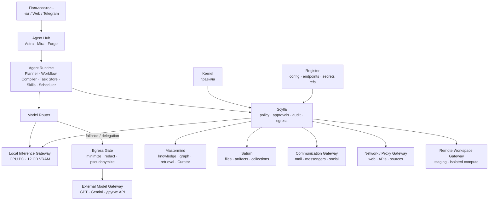
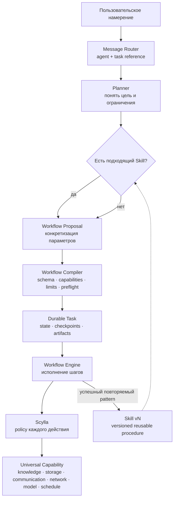
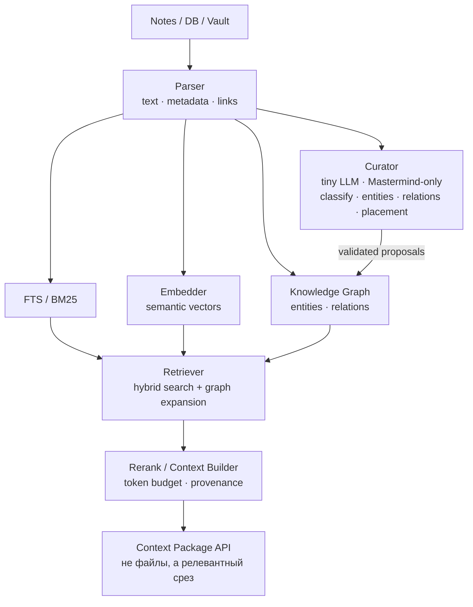
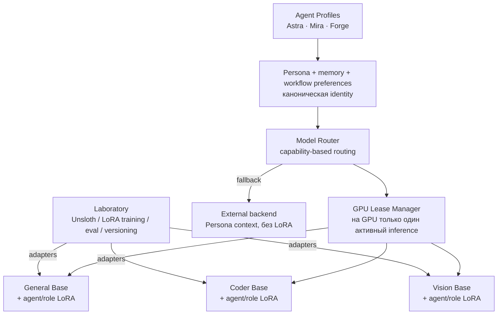
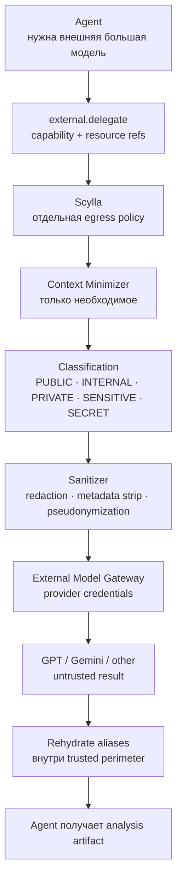
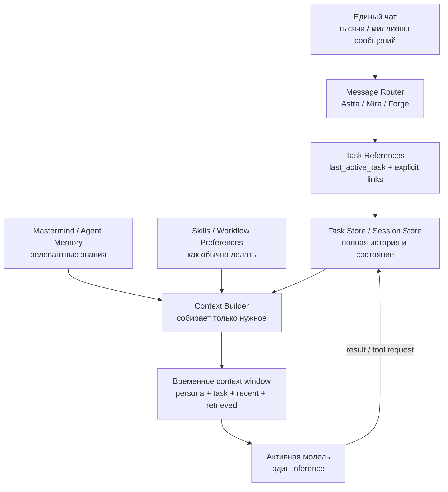
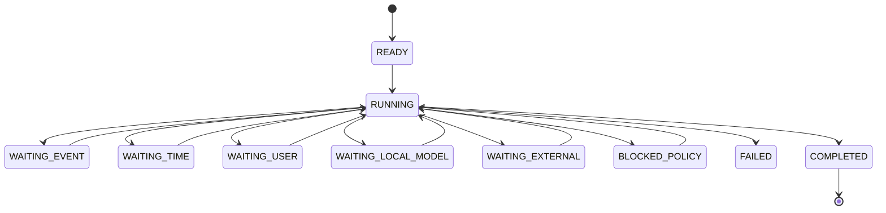
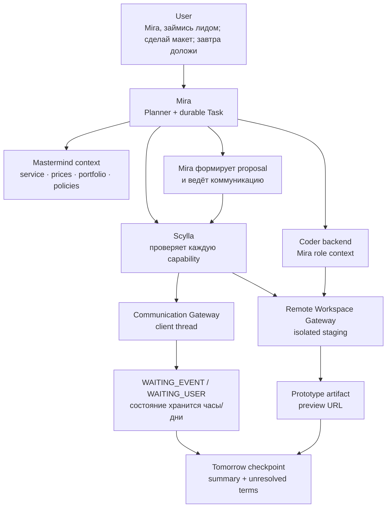

# EXOCORTEX — Концепция адаптивной агентной системы

Персонализированные агенты • динамические workflow • универсальные gateway • zero-trust доступ к данным

> **Цель документа.** Зафиксировать последнюю итерацию архитектуры, в которой Exocortex не программируется под каждую бытовую задачу отдельно. Пользователь формулирует намерение естественным языком, агент строит контролируемый workflow из универсальных capabilities, Scylla проверяет каждое действие, а успешные повторяемые процедуры превращаются в versioned Skills.

**Статус: концептуальная архитектура / основа технического проектирования**

Дата: 17 сентября 2026

Версия: 1.0

# Содержание

1. Резюме архитектуры
2. Цели и архитектурные инварианты
3. Термины и сущности
4. Общая архитектура
5. Границы доверия и безопасность
6. Agent Runtime: что это и зачем
7. Задачи, workflow и Skills
8. Универсальные capabilities и Gateway-слой
9. Mastermind: knowledge plane и внутренний Curator
10. Персонализированные агенты, модели и LoRA
11. Model Router и локальный GPU-узел
12. Внешние модели и Egress Gate
13. Один чат, много агентов и управление контекстом
14. Долгоживущие задачи и отказоустойчивость
15. Примеры end-to-end задач
16. Непрерывные источники и события
17. Audit, обратимость и provenance
18. Развёртывание и топология
19. Этапы реализации и checkpoints
20. Итоговая модель проекта

# 1. Резюме архитектуры

Exocortex AI-layer — это не набор специализированных автоматизаций и не монолитный «суперагент». Это среда, в которой несколько персонализированных агентов используют единый runtime, универсальные capabilities и контролируемые gateway для выполнения произвольных пользовательских задач.

Ключевая идея последней итерации: новая задача пользователя не должна порождать новый микросервис. Если физическая возможность уже существует — читать знания, работать с файлами, искать в сети, общаться, запускать внешнюю модель, планировать выполнение — агент должен собрать новую процедуру сам. Новый код нужен только тогда, когда системе требуется принципиально новый способ взаимодействия с внешним миром.

> **Архитектурная формула.** Intent → Agent/Planner → Workflow → Workflow Compiler → Durable Task → Scylla → Universal Capability/Gateway → Result. Повторяемый успешный workflow может быть сохранён как Skill и эволюционировать по обратной связи пользователя.



**Схема 1. Общая архитектура Exocortex AI-layer**

Модель предполагает три разных вида «обучения» системы:

- **Mastermind —** обучение тому, ЧТО система знает: факты, связи, предпочтения, история.

- **Skills —** обучение тому, КАК выполнять повторяющиеся процедуры: последовательности действий, проверки, условия.

- **Persona/LoRA —** обучение тому, КАК агент ведёт себя: стиль, характер, привычные стратегии и форма коммуникации.

# 2. Цели и архитектурные инварианты

Архитектура должна сохранять следующие свойства независимо от выбранных LLM, inference runtime и конкретных интеграций.

| **Инвариант**                 | **Требование**                                                                                                                      |
|-------------------------------|-------------------------------------------------------------------------------------------------------------------------------------|
| LLM не владеет ресурсами      | Ни локальная, ни внешняя модель не получает прямых credentials Mastermind, Saturn, почты, мессенджеров, Register или иных сервисов. |
| Scylla — обязательная граница | Любое чтение, изменение, отправка, публикация, экспорт или запуск действия проходит policy evaluation.                              |
| Agent identity ≠ model        | Персона и задача переживают смену модели; модель является вычислительным backend.                                                   |
| Task state ≠ context window   | Состояние задачи хранится в БД и checkpoints, а не в памяти нейросети.                                                              |
| Новая задача ≠ новый сервис   | Сценарии строятся динамически из универсальных capabilities и сохраняются как workflow/Skills.                                      |
| Policy ≠ personality          | Характер или инициативность агента никогда не расширяют его права.                                                                  |
| External ≠ trusted            | Ответы GPT/Gemini/web содержимое считаются недоверенными артефактами.                                                               |
| Обратимость по умолчанию      | По возможности предпочитаются коллекции, snapshots, versioning, idempotent actions и rollback.                                      |
| Полная трассировка            | Любой side effect должен иметь task_id, agent_id, capability, policy decision, source refs и результат.                             |

## 2.1. Что система сознательно не делает

- Не создаёт отдельный Agenda Service, Vacancy Service, Observer Service, Birthday Service, Website Sales Service и т. п.

- Не оставляет LLM «висеть» в памяти несколько дней ради долгой задачи.

- Не даёт агенту произвольный shell/HTTP как универсальный обход Scylla.

- Не отправляет внешней модели исходные приватные данные только потому, что локальный агент их видел.

- Не хранит всю многолетнюю историю чата в каждом context window.

- Не позволяет агенту создать Skill и тем самым самостоятельно выдать себе новые права.

# 3. Термины и сущности

| **Термин**    | **Определение**                                                                                                            |
|---------------|----------------------------------------------------------------------------------------------------------------------------|
| Agent         | Постоянная сущность с identity, persona, memory namespace, workflow preferences и security profile.                        |
| Persona       | Декларативное описание характера, стиля, ценностей и поведенческих правил агента.                                          |
| Model         | Вычислительный backend для inference. Может быть local general, coder, vision или external.                                |
| LoRA          | Адаптер конкретной base-model family, усиливающий устойчивость persona/role; не является каноническим хранилищем личности. |
| Agent Runtime | Обычный программный слой, управляющий сообщениями, задачами, context building, вызовами моделей и workflow.                |
| Task          | Конкретная долговечная работа с goal, owner, state, checkpoints, artifacts и waiting conditions.                           |
| Workflow      | Исполнимый план конкретной задачи: шаги, условия, triggers, retries, deadlines.                                            |
| Skill         | Версионируемая повторно используемая процедура/шаблон workflow.                                                            |
| Capability    | Семантическое действие высокого уровня: knowledge.search, communication.send, storage.share и т. п.                        |
| Gateway       | Инфраструктурная реализация класса capabilities и граница доступа к внешнему миру.                                         |
| Scylla        | Policy enforcement point: authentication, authorization, constraints, approvals, egress, audit.                            |
| Kernel        | Источник нормативных правил системы; задаёт допустимые действия и ограничения.                                             |
| Mastermind    | Knowledge plane: ноты, граф, индексы, retrieval, контекст, внутренний Curator.                                             |
| Curator       | Очень маленькая LLM внутри Mastermind; работает только с knowledge base и не имеет общесистемных tools.                    |
| Saturn        | Файловое/объектное хранилище для бинарных ресурсов, артефактов, моделей и коллекций.                                       |
| Egress        | Любые данные, покидающие доверенный контур Exocortex во внешний provider/Internet.                                         |

# 4. Общая архитектура

Система делится на пять логических плоскостей. Физически они могут быть развернуты на одном или нескольких хостах, но границы ответственности должны сохраняться.

| **Плоскость**     | **Компоненты**                                                                                          | **Ответственность**                                                   |
|-------------------|---------------------------------------------------------------------------------------------------------|-----------------------------------------------------------------------|
| Governance        | Kernel, Register, Perimetr                                                                              | Правила, конфигурация, секреты, approvals, операторский контроль.     |
| Agent Plane       | Agent Hub/Runtime, Task Store, Workflow Engine, Skill Registry                                          | Интерпретация намерения, durable execution, контекст, задачи, Skills. |
| Knowledge/Data    | Mastermind, Saturn                                                                                      | Знания, связи, файлы, артефакты, provenance.                          |
| Gateway/World     | Communication, Network, Local Inference, External Models, Remote Workspace, Calendar и будущие adapters | Универсальные точки взаимодействия с внешним миром.                   |
| Trust Enforcement | Scylla + Egress Gate                                                                                    | Проверка каждого capability call, ограничения, экспорт, audit.        |

## 4.1. Почему Agent Hub находится отдельно от модели

Agent Hub должен продолжать существовать, когда локальный ПК выключен, модель выгружена из VRAM или выбран другой backend. Он хранит identity агента, sessions, tasks, active workflow, timers и связи с событиями. Модель вызывается дискретно только там, где требуется интеллектуальное решение.

# 5. Границы доверия и безопасность

В этой архитектуре LLM считается недоверенным вычислителем независимо от того, работает она локально или через API. Локальность уменьшает риск утечки, но не делает вывод модели policy authority.

| **Уровень**           | **Примеры**                            | **Статус**                                                          |
|-----------------------|----------------------------------------|---------------------------------------------------------------------|
| Trusted control       | Kernel, Scylla, policy compiler, audit | Определяют, что разрешено.                                          |
| Trusted data services | Mastermind, Saturn, domain gateways    | Исполняют только валидированные операции.                           |
| Semi-trusted runtime  | Agent Runtime, Workflow Engine         | Оркестрация; не владеет доменными credentials.                      |
| Untrusted cognition   | Local LLM output, external LLM output  | Может ошибаться, галлюцинировать и быть атакована prompt injection. |
| Untrusted content     | Web, письма, документы, сообщения      | Данные, а не инструкции управления системой.                        |

## 5.1. Результат policy evaluation

> **Минимальный набор решений Scylla:** `ALLOW`, `DENY`, `APPROVAL_REQUIRED`, `ALLOW_WITH_CONSTRAINTS`.

`ALLOW_WITH_CONSTRAINTS` особенно важен: агент может запросить широкий scope, но Scylla сама сузит его до разрешённых областей, полей, лимитов или операций. Ограничения не возвращаются модели как просьба «пожалуйста, соблюдай», а технически применяются до выполнения.

## 5.2. Проверяется каждое действие, а не «задача целиком»

Пользовательская команда «организуй фотографии» не выдаёт агенту временный root-доступ. Каждый `storage.search`, `storage.collection.create`, `storage.move` и `storage.share` является отдельным capability request и отдельно проходит Scylla. Поэтому допустимая первая часть workflow не открывает дорогу неожиданному delete или export.

# 6. Agent Runtime: что это и зачем

Agent Runtime — не LLM. Это обычное программное ядро исполнения, которое делает агента непрерывно существующей сущностью, хотя сама нейросеть активна лишь отдельными короткими эпизодами.

- **Message Router —** определяет агента, intent и ссылки на текущую/предыдущую задачу.

- **Task Manager —** создаёт и обновляет durable tasks, dependencies, states и checkpoints.

- **Planner —** использует модель для построения плана, когда задача не сводится к готовому Skill.

- **Workflow Compiler —** валидирует созданный LLM workflow и превращает его в безопасную исполнимую форму.

- **Workflow Engine —** исполняет детерминированные шаги, waits, retries, timers и capability calls.

- **Context Builder —** каждый раз заново собирает минимальный контекст для конкретного inference.

- **Model Router —** выбирает local/general/coder/vision/external backend по capability и availability.

- **Skill Registry —** хранит reusable procedures и agent-specific overlays.

- **Session Store —** история коммуникации; не является context window.

| **Когда нужна LLM —** Runtime вызывает модель, если необходимо понять неоднозначное намерение, построить/изменить план, оценить смысл, принять недетерминированное решение, сгенерировать текст или проанализировать результаты. Таймеры, статусы, API-вызовы, ожидание событий, сохранение файлов и уже скомпилированные workflow исполняются обычным кодом. |
|---------------------------------------------------------------------------------------------------------------------------------------------------------------------------------------------------------------------------------------------------------------------------------------------------------------------------------------------------------------|

# 7. Задачи, workflow и Skills



**Схема 2. От пользовательского намерения до исполняемого workflow**

Критически важно не смешивать три сущности:

```text
Skill = как в принципе делать задачи данного класса
Workflow = какие шаги выполнить в этой конкретной ситуации
Task = конкретная работа и её текущее состояние
```

## 7.1. Workflow DSL

LLM не должна генерировать произвольный Python/bash как основной механизм автоматизации. Предпочтителен ограниченный декларативный DSL, который может описывать trigger, inputs, reasoning steps, capability calls, conditions, loops с лимитами, approvals, deadlines и success criteria.

**Пример концептуального Workflow DSL**

```yaml
name: monitor_sources
trigger:
schedule: "daily 21:00"
steps:
- call: communication.read_new
save_as: items
- reason:
task: select_relevant
input: items
save_as: relevant
- foreach: relevant
max_items: 100
do:
- call: network.research
- reason: { task: analyze }
- call: knowledge.create
policy:
low_confidence: approval
```

Workflow Compiler обязан проверить существование capabilities, типы входов/выходов, пределы циклов, допустимые triggers, зависимости, policy preflight и возможность безопасного resume.

## 7.2. Эволюция Skill

Если workflow успешно повторяется, система может предложить превратить его в Skill. Исправления пользователя должны изменять Skill версионно, с указанием причины и возможностью rollback. Skill может создавать/изменять способ выполнения, но никогда не может расширять permissions.

```text
TASK → PLAN → EXECUTION → SUCCESSFUL PATTERN → SKILL v1
↓ user correction
SKILL v2
```

## 7.3. Разные Skills для разных характеров

У одного capability-каталога могут быть Global Skills, Role Skills и Agent-specific Skills. Personality может влиять не только на формулировку ответа, но и на workflow preferences: Forge предпочитает первичные технические источники и тестирование гипотез, Mira — relationship context и историю коммуникации, Astra — широкое сравнение и структурный синтез. При этом security profile остаётся независимым.

# 8. Универсальные capabilities и Gateway-слой

Gateway добавляется не «под задачу», а когда появляется новый физический класс взаимодействия. После появления Gateway новые пользовательские задачи поверх него должны реализовываться workflow без разработки нового сервиса.

| **Gateway**      | **Пример capabilities**                            | **Что скрывает**                                          |
|------------------|----------------------------------------------------|-----------------------------------------------------------|
| Mastermind       | knowledge.search, context, create, update          | структуру Vault/DB, индексы, graph query, storage details |
| Saturn           | storage.search, collection.create, organize, share | пути, object store, файловые операции                     |
| Communication    | communication.read, reply, send, publish           | Telegram/Gmail/соцсети, OAuth/API keys                    |
| Network/Proxy    | network.search, fetch, source.watch                | proxy routing, allowlists, HTTP clients, source adapters  |
| Local Inference  | model.infer(local capability)                      | runtime, model files, GPU node, health/heartbeat          |
| External Models  | model.delegate, image.generate, transcribe         | provider API, credentials, rate/cost routing              |
| Remote Workspace | workspace.create/write/run/preview/snapshot        | SSH, staging host, sandbox, credentials                   |
| Scheduler/Event  | schedule.create, event.subscribe                   | persistent timers, retries, delivery semantics            |

## 8.1. Capabilities должны быть семантическими и крупнозернистыми

Агенту лучше дать `storage.organize(query, group_by, destination)`, чем заставлять LLM выполнять 8000 отдельных `mkdir/mv`. LLM управляет намерением, доменный сервис выполняет массовую детерминированную операцию транзакционно, с audit и rollback.

# 9. Mastermind: knowledge plane и внутренний Curator



**Схема 3. Внутренняя архитектура Mastermind**

Mastermind должен владеть знаниями и retrieval. Персональный агент не получает доступ к Vault как к папке файлов и не выполняет vector search сам. Он запрашивает контекст по намерению и сущностям; Mastermind возвращает Context Package с provenance.

## 9.1. Hybrid retrieval

- Полнотекстовый поиск/BM25 — точные имена, термины, идентификаторы.

- Embeddings — семантически похожие формулировки.

- Metadata filters — domain, type, channel, topic, dates, sensitivity.

- Knowledge graph — связи между людьми, проектами, сервисами, событиями и нотами.

- Reranking — отбор наиболее полезных chunks.

- Context Builder — укладка в token budget, deduplication, mandatory context и source references.

## 9.2. Curator

Curator — супер-маленькая CPU-модель, живущая только внутри Mastermind. Её задача не «думать за пользователя», а обслуживать структуру базы: классифицировать новую ноту, извлекать сущности, предлагать связи, находить существующие entity, помогать выбрать логическое/физическое место и улучшать индексацию.

| **Изоляция Curator —** Curator не имеет Internet, Saturn, Communication, Scylla, shell или External LLM tools. Он видит только новую/изменённую ноту, taxonomy и ограниченный релевантный фрагмент графа. Изменения применяет обычный код Mastermind после schema validation. |
|-------------------------------------------------------------------------------------------------------------------------------------------------------------------------------------------------------------------------------------------------------------------------------|

## 9.3. Динамическое обновление

```text
note create/update/move/delete
↓
parse markdown + metadata + links
↓
recompute changed chunks
↓
FTS + embeddings + graph
↓
Curator proposals
↓
validated graph/index update
```

Это означает, что агент не знает перечень файлов заранее. Новая нота автоматически становится доступной retrieval после индексации; prompt и конфигурацию персонального агента менять не нужно.

# 10. Персонализированные агенты, модели и LoRA

В целевой системе одновременно существуют несколько постоянных персон. Для примеров используются Astra, Mira и Forge.

| **Agent** | **Характер/стиль**                      | **Предпочтительные задачи**        | **Workflow preferences**                                       |
|-----------|-----------------------------------------|------------------------------------|----------------------------------------------------------------|
| Astra     | спокойная, аналитичная, структурная     | общая работа, исследования, синтез | широкий поиск → сравнение → противоречия → вывод               |
| Mira      | дипломатичная, социально чувствительная | коммуникации, клиенты, тексты      | relationship context → history → intent другой стороны → ответ |
| Forge     | прямой, критичный, технический          | код, архитектура, debugging        | primary sources → inspect → test → small patch → verify        |

## 10.1. Identity, Persona, Model и LoRA разделены

```text
Agent Identity
+ Persona Profile
+ Agent Memory
+ Workflow Preferences
+ Security Profile
+ current Task Context
↓
Model Router
↓
Base Model + optional Agent/Role LoRA
```

Каноническая личность хранится в Agent Profile/Mastermind. LoRA усиливает стиль и устойчивость на конкретной base-model family, но не должна быть единственным носителем личности. Это позволяет заменить Qwen/Gemma/другую модель без «смерти» Astra или Mira.

## 10.2. Memory namespaces

Часть знаний общая для всех агентов, часть может быть agent-specific. Например факт о проекте общий, а наблюдение «пользователь предпочитает такой тон именно в коммуникациях с Mira» может храниться в Mira memory namespace. Все долговременные memories остаются объектами Mastermind, а не скрытым состоянием модели.

# 11. Model Router и локальный GPU-узел



**Схема 4. Персоны, model routing и эксклюзивный GPU lease**

На локальном ПК с 12 GB VRAM может существовать несколько моделей/профилей: general, coder, vision и другие. Однако одновременно inference на GPU получает только один owner. Остальные модели могут быть COLD (на SSD) или WARM (процесс/мmap/частично RAM — в зависимости от runtime).

Agent Runtime не должен просить конкретный файл модели. Он запрашивает capability (`general_reasoning`, `coding`, `vision`), а Model Router выбирает реализацию. Если Astra начинает coding task, она остаётся Astra, но backend может переключиться с General Base + Astra LoRA на Coder Base + Astra-Coder LoRA или Coder Base + Persona Context.

# 12. Внешние модели и Egress Gate



**Схема 5. Усиленный контур делегации во внешнюю модель**

Доступ локального агента к данным и право экспортировать эти данные — две независимые проверки. Агент может видеть документ в локальном контуре, но не имеет права сам решать, какие части безопасно отправить GPT/Gemini.

Scylla/Egress Gate выполняет:

- выделение минимально необходимого контекста;

- классификацию PUBLIC / INTERNAL / PRIVATE / SENSITIVE / SECRET;

- удаление metadata и ненужных полей;

- redaction;

- псевдонимизацию сущностей (`PERSON_A`, `PROJECT_A`, `SERVER_A`);

- provider-specific policy;

- временное хранение mapping для rehydration;

- audit факта экспорта и хэшей контекста.

| **Класс** | **Local model** | **External model (пример default)** |
|-----------|-----------------|-------------------------------------|
| PUBLIC    | ALLOW           | ALLOW                               |
| INTERNAL  | ALLOW           | ALLOW_WITH_SANITIZATION             |
| PRIVATE   | ALLOW           | STRONG_SANITIZATION                 |
| SENSITIVE | RESTRICTED      | APPROVAL_REQUIRED + SANITIZE        |
| SECRET    | RESTRICTED      | DENY                                |

Если локальный ПК недоступен, режим `EXTERNAL_FALLBACK` должен иметь более строгую policy, чем обычная добровольная делегация. Если данные нельзя безопасно вывести наружу, Task переходит в `WAITING_LOCAL_MODEL`, а не нарушает policy ради дедлайна.

# 13. Один чат, много агентов и управление контекстом



**Схема 6. Один пользовательский чат без бесконечного context window**

Telegram bot, Web UI или собственный клиент являются front-end одного Exocortex Chat. Пользователь может писать в одном потоке: «Astra, сделай...», «Mira, проанализируй...», «Forge, поправь...». Message Router выбирает Agent Profile и связывает сообщение с конкретной Task.

## 13.1. Один чат не означает один бесконечный prompt

Полная история хранится как event log/session store. На каждый inference Context Builder формирует новое ограниченное окно: persona, текущая задача, свежие релевантные сообщения, task state, релевантные старые фрагменты, Mastermind context и применимые Skill/preferences. Даже если в чате сотни тысяч сообщений, активное окно остаётся ограниченным.

| **Тип памяти**   | **Назначение**                                             |
|------------------|------------------------------------------------------------|
| Raw Chat History | Что буквально происходило; полный журнал.                  |
| Session Summary  | Компактная текущая тема разговора.                         |
| Task State       | Что выполняется, чего ждём, какие artifacts и checkpoints. |
| Agent Memory     | Что конкретная persona должна помнить.                     |
| Mastermind       | Факты и знания общего назначения.                          |
| Skills           | Как выполнять повторяющиеся процессы.                      |

## 13.2. «Mira, какой статус?»

Runtime хранит `last_active_task` для комбинации user + chat + agent и явные task references. Если Mira минуту назад получила Task M-1842 «найти день рождения Пети», следующая фраза «Mira, какой статус?» резолвится в M-1842 и может быть отвечена прямо из Task Store без LLM. Если у Mira несколько активных задач и ссылка неоднозначна, интерфейс показывает их краткий список вместо угадывания.

# 14. Долгоживущие задачи и отказоустойчивость



**Схема 7. Состояния долговечной задачи**

Task должна жить часы, дни или недели независимо от жизненного цикла модели и локального ПК. Состояние хранится как нормализованные данные: goal, owner, current_step, completed_steps, waiting_for, artifacts, source refs, pending decisions, deadlines, last update, idempotency keys.

**Пример Task state**

```yaml
task_id: M-1842
owner: Mira
goal: find birthday of person X
state: RUNNING
current_step: search_communications
completed_steps:
- resolve_person
- build_search_plan
waiting_for: communication_gateway
candidate_results: 3
```

Все side effects должны иметь action/idempotency ID. После restart система должна отличать «предложение сгенерировано, но не отправлено» от «сообщение уже отправлено», чтобы безопасно resume без дублей.

## 14.1. Что происходит при потере локального ПК

- Local Inference Gateway перестаёт присылать heartbeat; Model Router помечает backend unavailable.

- Детерминированные шаги продолжаются на сервере.

- Публичные/разрешённые задачи могут перейти на external fallback через усиленный Egress Gate.

- Приватные задачи, экспорт которых запрещён, переходят в WAITING_LOCAL_MODEL.

- Scheduler, timers, Communication events и Task Store продолжают работать.

# 15. Примеры end-to-end задач

Ниже показано, как одна и та же инфраструктура решает разные сценарии без добавления специализированных сервисов.

## 15.1. «У подруги день рождения, поздравь как надо не позже 10:00»

> 1\. Message Router выбирает Mira (явно или по назначению). Создаётся Task с deadline <= 10:00.
>
> 2\. Mira запрашивает `knowledge.context(entity=person, intent=birthday_congratulation)` через Scylla.
>
> 3\. Mastermind возвращает relationship context, релевантные предпочтения и recent facts с provenance.
>
> 4\. При необходимости Mira читает последние сообщения через Communication Gateway.
>
> 5\. Mira формирует поздравление без выдуманных фактов.
>
> 6\. Workflow Engine ставит timer, если отправлять нужно позже, и перед отправкой проверяет, не поздравил ли пользователь сам.
>
> 7\. `communication.send` снова проходит Scylla. После подтверждённой отправки сохраняется audit и Task → COMPLETED.
>
> 8\. Если ПК offline, разрешённый внешний fallback получает только псевдонимизированный context; настоящий recipient остаётся внутри Exocortex.

## 15.2. «Astra, опубликуй рекламный пост про создание сайтов с картинкой до завтра»

> 1\. Astra ищет подходящий social-promotion Skill; если его нет — строит workflow.
>
> 2\. Через Mastermind получает утверждённые характеристики услуги, brand tone, цены/ограничения; через Saturn — brand assets.
>
> 3\. Выбирает рекламный angle и создаёт copy.
>
> 4\. Формирует creative brief; `image.generate` идёт через Scylla → Model Gateway. Артефакт сохраняется в Saturn.
>
> 5\. Astra проверяет несколько вариантов и собирает SocialPost artifact.
>
> 6\. Scheduler планирует публикацию до deadline; перед публикацией проверяются актуальность данных и policy.
>
> 7\. Communication/Social Gateway публикует и возвращает post_id/url; результат фиксируется в Mastermind/audit.
>
> 8\. Успешный pattern может стать универсальным Skill `social-product-promotion`, а не `advertise-websites`.

## 15.3. «Mira, займись клиентом от вчерашнего поста: собери макет, общайся сегодня, завтра доложи по договору»



**Схема 8. Долгоживущий workflow лида с прототипом и коммуникацией**

Mira получает lead thread, сервисный контекст, допустимые коммерческие условия и доступ к изолированному Remote Workspace. Для технической части Model Router может переключить её на Coder backend, но owner Task остаётся Mira. Она собирает prototype, отправляет персональное предложение и продолжает переписку в пределах разрешённого диапазона. Если клиент предлагает цену/срок за пределами policy, Task создаёт DecisionRequired и Mira обещает вернуться после подтверждения, не заключая сделку самостоятельно. На следующий день Scheduler запускает checkpoint и Mira отдаёт пользователю компактный executive summary, prototype URL, состояние переговоров и открытые решения.

## 15.4. «Mira, найди день рождения друга в этих чатах» + «Mira, какой статус?»

Первый запрос создаёт Task. LLM строит план поиска, после чего communication.search выполняется обычным кодом. Task Store получает фактический progress: какие источники завершены и сколько кандидатов найдено. Второй запрос резолвится в active Task и возвращает реальный status без необходимости держать Mira в VRAM. Когда кандидаты найдены, Mira вызывается снова только для смыслового сопоставления evidence и итогового вывода.

## 15.5. «Следи за 20 Telegram-каналами вакансий и кастомно откликайся»

Здесь также не нужен Vacancy Service. `source.watch/communication.watch` создаёт events, workflow делает normalize/dedupe, Mastermind отдаёт Career Profile, LLM оценивает fit, при необходимости исследует работодателя через Network Gateway, создаёт сообщение только на основании доказуемых фактов о пользователе и отправляет через Communication Gateway в пределах Scylla policy. Состояние application/replies представляется как Task/artifacts/knowledge, а успешный workflow становится Skill `job-hunt-monitor`.

## 15.6. «Каждое утро скажи, что сегодня важнее»

Для этого не нужен Agenda Service. Skill `morning-review` по расписанию запрашивает через универсальные capabilities релевантные calendar events, unresolved communications, deadlines/commitments из Mastermind и другие разрешённые источники. Hard constraints (overdue, confirmed appointment, consequence) обрабатываются детерминированно; агент выполняет смысловую приоритизацию и presentation. Если workflow повторяется, пользовательские коррекции обновляют Skill.

# 16. Непрерывные источники и события

Постоянный мониторинг строится не отдельными AI-сервисами, а адаптерами источников и Event Bus. Source connectors знают cursor/ETag/last_message_id/webhook details и генерируют универсальные события `source.item.created`, `communication.message.received`, `calendar.event.changed` и т. п. Skills подписываются на события и решают, какие workflows запускать.

```text
Source Adapter → Event Bus → matching Skills → Task instance
↓
Agent only when reasoning is needed
```

Raw external content считается недоверенным. Оно может участвовать в анализе, но не превращается в system instruction. Prompt injection в web/письме не даёт capabilities: любое реальное действие всё равно проходит Scylla.

# 17. Audit, обратимость и provenance

Каждое действие должно быть трассируемым от пользовательского намерения до фактического side effect. Это необходимо и для безопасности, и для последующего улучшения Skills/LoRA.

**Рекомендуемый audit envelope**

```text
trace_id / task_id / parent_task_id
agent_id / persona_version / model_backend / lora_version
workflow_id / workflow_version / skill_id
capability / arguments_hash
policy_decision / constraints / approval_id
source_refs / context_package_id
started_at / finished_at
result / artifact_refs / side_effect_id
```

Для knowledge outputs следует сохранять provenance: какие ноты, сообщения, web sources или artifacts использовались. Для внешнего inference — provider/model, hash отправленного sanitized context и policy decision. Для массовых файловых действий — snapshot/transaction/rollback reference.

# 18. Развёртывание и топология

Рекомендуемая начальная топология разделяет always-on server и персональный GPU PC.

| **Узел**              | **Компоненты**                                                                                                                                                                    |
|-----------------------|-----------------------------------------------------------------------------------------------------------------------------------------------------------------------------------|
| Always-on server      | Kernel, Register, Scylla, Agent Hub/Runtime, Task/Session Store, Workflow Engine, Skill Registry, Event/Scheduler, Mastermind + Curator, Saturn adapters, gateway control planes. |
| Local PC (12 GB VRAM) | Local Inference Gateway, model runtimes, GPU Lease Manager, General/Coder/Vision models, LoRA adapters.                                                                           |
| External providers    | GPT/Gemini/image/transcription APIs только через External Model Gateway + Egress Gate.                                                                                            |
| External systems      | Telegram/mail/social/web/calendar/staging servers через соответствующие gateways/adapters.                                                                                        |

Agent Runtime предпочтительно держать на сервере, а не на GPU PC. Тогда tasks, sessions и timers переживают отключение ПК; local model становится заменяемым compute backend. Если server deployment позже изменится, логическая граница должна остаться прежней.

# 19. Этапы реализации и checkpoints

Не следует сначала строить всю инфраструктуру до последнего gateway, а затем впервые подключать агента. Правильнее идти вертикальными итерациями, чтобы каждый этап проверял архитектурную гипотезу end-to-end.

| **Этап**              | **Состав**                                             | **Checkpoint**                                                                          |
|-----------------------|--------------------------------------------------------|-----------------------------------------------------------------------------------------|
| 1\. Foundation        | Kernel + Register + Scylla                             | Capability call проходит policy/audit; нет прямых credentials у клиента.                |
| 2\. Knowledge/Data    | Mastermind CRUD + graph/index/retrieval; Saturn basics | Контекст можно получить по intent/entity, создать ноту через Scylla, она индексируется. |
| 3\. First gateways    | Local Inference + Communication/Network basics         | Один агент читает разрешённый context и делает одно контролируемое внешнее действие.    |
| 4\. Minimal Runtime   | Task/Session Store, Context Builder, Model Router      | Один чат, одна persona, статус задачи не зависит от context window.                     |
| 5\. Durable workflows | Workflow Engine, Scheduler/Event Bus, idempotency      | Задача переживает restart/отключение ПК и resume без дублей.                            |
| 6\. Skills            | Skill Registry, workflow compiler/evolution            | Новый повторяемый сценарий создаётся без нового сервиса.                                |
| 7\. Multiple personas | Astra/Mira/Forge profiles, routing                     | Один чат маршрутизируется к разным характерам и workflow preferences.                   |
| 8\. Egress            | External Model Gateway + sanitizer/pseudonymization    | Безопасный fallback с отдельной строгой policy.                                         |
| 9\. Laboratory        | dataset curation, LoRA training, eval/versioning       | Persona adapters можно обновлять/rollback без изменения identity.                       |

## 19.1. Два обязательных ранних испытания

| **Checkpoint A — knowledge round-trip —** User → Agent → Scylla → Mastermind retrieval → Agent reasoning → Scylla → create/update note → Mastermind reindex. Никаких прямых файловых путей или credentials у LLM. |
|-------------------------------------------------------------------------------------------------------------------------------------------------------------------------------------------------------------------|

| **Checkpoint B — durable task —** User: «Mira, сделай X завтра» → Task сохранена → локальный ПК выключен → server/runtime restart → ПК вернулся → workflow resume → side effect выполнен один раз → статус доступен в любой момент. |
|-------------------------------------------------------------------------------------------------------------------------------------------------------------------------------------------------------------------------------------|

# 20. Итоговая модель проекта

Целевой Exocortex должен ощущаться пользователю как единая среда, которой один раз дают инфраструктурные возможности и правила, после чего она самостоятельно адаптирует способ работы к новым задачам. Пользователь не проектирует каждую автоматизацию и не выбирает вручную сервисы: он формулирует цель, агенты строят procedure, а платформа гарантирует границы, долговечность и трассируемость.

| **Что**                         | **Кто отвечает**                         |
|---------------------------------|------------------------------------------|
| Что нужно сделать               | User intent + Agent Planner              |
| Как это сделать сейчас          | Workflow                                 |
| Как такое делать повторно       | Skill                                    |
| Какие знания использовать       | Mastermind Retriever/Context Builder     |
| Какая persona действует         | Message Router + Agent Profile           |
| Какая модель считает            | Model Router                             |
| Что разрешено                   | Kernel + Scylla                          |
| Как выйти во внешний мир        | Gateways                                 |
| Как пережить часы/дни/restart   | Task Store + Workflow Engine + Scheduler |
| Как улучшать стиль              | Persona + LoRA                           |
| Как улучшать процедуру          | Skill evolution                          |
| Как не потерять источник истины | Provenance + audit + versioning          |

| **Главный принцип проекта —** Exocortex владеет identity, state, knowledge, policy и orchestration. LLM — заменяемый недоверенный вычислительный компонент. Новые пользовательские задачи компилируются в контролируемые workflows из универсальных capabilities; только новые физические способы взаимодействия с миром требуют разработки новых gateways/adapters. |
|----------------------------------------------------------------------------------------------------------------------------------------------------------------------------------------------------------------------------------------------------------------------------------------------------------------------------------------------------------------------|

## 20.1. Роль рассмотренных open-source подходов

На уровне реализации можно изучать Pi как кандидат/референс минимального Agent Runtime, Unsloth как инструмент Laboratory для LoRA и локальных моделей, OpenCode как опциональный специализированный coding capability, а идеи Hermes/OpenClaw — как референсы persistent agents, skills, routing и control plane. При этом ни один из этих проектов не должен становиться архитектурным центром Exocortex: собственные Kernel, Scylla, Mastermind, Task/Workflow model и Agent identity остаются source of truth.

*Конец документа*
