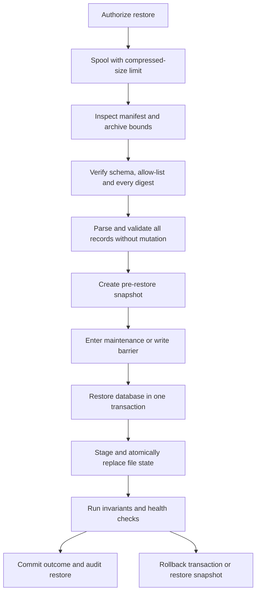

# Part 03. Backup And Recovery

> This is a normative component of the [Part 00 documentation authority](./PART_00_SYSTEM_UNIFICATION_SPECIFICATION.md).

The key words **MUST**, **MUST NOT**, **SHOULD**, **SHOULD NOT** and **MAY** are
normative. Numeric defaults may change only after workload measurement, while
the safety property behind every limit MUST be preserved.

## Central Authority And Material Divergence

This Part takes precedence over conflicting project-local documentation.
Project documents MUST adapt these rules to current project-specific values
without weakening them. A material implementation difference follows the
reporting and decision protocol in [Part 00](./PART_00_SYSTEM_UNIFICATION_SPECIFICATION.md#1-mandatory-material-divergence-protocol); stale local documentation is corrected and is not an alternative authority.

---
## 13. Recovery Contract Before File Format

A backup is correct only if a tested restore can recreate the promised state.
Start by defining:

- recovery point objective: how much recent data may be lost;
- recovery time objective: how long restore and verification may take;
- backup scope: complete service, one tenant/resource, or configuration only;
- replacement semantics: replace, merge or create a new revision;
- key dependency: which external secret or key is required to decrypt protected
  fields;
- version compatibility: which application and database schemas may restore
  the archive.

The application owns logical backup semantics. A shared backup agent may transport exact
opaque backup bytes to the approved remote destination, and the local update helper may stage those bytes for
an application update or rollback. Neither component may interpret domain
records or silently change archive meaning. Automatic scheduling, enrollment
and transfer lifecycle are defined in
[Service Agents: Deployment, Initialization And Lifecycle](./PART_09_SERVICE_AGENTS_DEPLOYMENT_AND_LIFECYCLE.md).

### 13.1 Settings Backup And Restore Experience

Part 01 section 5.5 defines the visual contract. `Create and download snapshot`
is one operator action: it creates a fresh logical ZIP and begins the
same-origin download when the archive is ready. Pending state prevents duplicate
creation. Completion identifies the timestamped filename; failure leaves
Settings open and provides a retry without claiming that a usable backup exists.

`Restore snapshot` opens the custom restore overlay. The overlay invokes the
operating system's native file picker, then shows sanitized filename, bounded
size and parsed format/version before confirmation. The native picker itself is
not replaced by simulated web UI. Archive validation completes before the
confirmation can start live mutation. Progress, successful health verification,
rollback and rollback failure remain explicit in the same operator workflow.

## 14. What A Backup Must And Must Not Contain

### 14.1 Mandatory Logical State

A complete logical backup MUST include, when applicable:

| Category | Required content |
| --- | --- |
| Identity | Stable IDs, public certificates, fingerprints, status and revocation or deny-list records |
| Authoritative domain state | Current records, relations, ordering and ownership needed to reproduce behavior |
| Configuration | Application settings and topology that are not deployment secrets |
| Authentication continuity | Access-Key verifier or password hashes and parameters only when operator access must remain usable |
| Protected recoverable material | Ciphertext plus encryption metadata, never an unprotected private value |
| Compatibility | Backup format, schema version, application version and creation time |
| Integrity | Per-member digest, uncompressed size and record count |
| Semantics | Scope, replace/merge policy and required restore order |

Revision history may be included when history itself is part of the product
contract. Export and restore MUST be symmetric: every advertised restorable
section is either consumed or explicitly labeled diagnostic-only.

### 14.2 Conditional Content

- Audit history and raw logs are optional diagnostic attachments. Their
  retention and privacy policy remain active inside a backup.
- Active sessions SHOULD be excluded by default. If continuity requires them,
  store only non-reversible session hashes and expire or revalidate them after
  restore.
- Cached external artifacts MAY be excluded when they are immutable,
  checksum-addressed and reliably downloadable. Include the desired version
  and digest so they can be reconstructed.
- Encrypted private material is useful only when the recovery process also has
  a separately protected key. Document that dependency and test it.

### 14.3 Forbidden Content

An application logical backup MUST NOT contain:

- plaintext passwords;
- bearer, API, service, session, enrollment or one-time tokens;
- cookies;
- decrypted connection credentials;
- raw private keys without an explicit encryption and escrow design;
- `.env` files;
- temporary files, update staging, caches or build output;
- container images or other reproducible binary dependencies;
- log records that bypass normal secret redaction.

Password hashes, public certificates and ciphertext are still sensitive. The
archive requires restricted access even when it contains no plaintext secret.
Deployment secrets use a separate secret-manager or encrypted disaster-recovery
procedure; they are not smuggled into the application backup.

## 15. Archive And Manifest Design

The operator-facing download and the opaque backup transported to a local
updater MUST be a ZIP archive with a `.zip` filename and the
`application/zip` media type. A complete logical backup MUST NOT be exposed as
a standalone downloadable JSON document: JSON or JSONL records belong inside
the bounded archive and are covered by its manifest. Restore endpoints MAY
accept a documented legacy JSON format only as a migration path; all newly
created backups use ZIP.

### 15.1 Recommended Layout

```text
manifest.json
data/
  configuration.json
  identities.jsonl
  resources.jsonl
  relations.jsonl
history/
  revisions.jsonl
diagnostics/
  audit.jsonl
README.txt
```

Only documented, allow-listed member names are accepted. JSON uses UTF-8,
stable field names and unambiguous UTC timestamps. Large collections use JSONL
so export and restore can stream records.

The manifest contains at least:

```json
{
  "format": "logical-backup",
  "schema_version": 1,
  "created_at": "<UTC timestamp>",
  "scope": "complete",
  "source_version": "<semantic version>",
  "restore_mode": "replace",
  "files": {
    "data/resources.jsonl": {
      "sha256": "<hex digest>",
      "uncompressed_bytes": 0,
      "records": 0
    }
  }
}
```

The field names are a generic example, not a required product namespace.

### 15.2 Integrity, Confidentiality And ZIP Safety

- Calculate a SHA-256 digest for every data member and verify all digests
  before mutation.
- A checksum detects corruption; it does not authenticate the publisher. When
  archives cross a trust boundary, sign the manifest or wrap the archive in an
  authenticated encryption format.
- Do not rely on legacy ZIP passwords.
- Enforce maximum compressed size before reading the upload.
- Inspect the directory before reading members. Enforce total uncompressed
  size, per-member size, member count and compression ratio.
- Reject absolute paths, drive-qualified paths, `..`, links and unknown files.
- Never extract directly into a live directory. Read allow-listed members or
  extract into a private staging directory with safe generated paths.
- Sanitize any optional log filename to its basename and extension allow-list.

Build large archives incrementally into a mode-`0600` spool file. Stream rows
from the database and files from disk. Do not first build every table as a
list, serialize every member into bytes and then copy the entire ZIP into RAM.

Reference restore endpoints currently use compressed upload ceilings between
32 MiB and 128 MiB, and the privileged update path accepts at most 128 MiB of
decoded logical-backup bytes. A unified product should select one documented
budget per backup scope and then size request, spool, temporary-disk and RAM
limits from that same value. The compressed ceiling never replaces the
uncompressed archive limits above.

## 16. Restore Procedure

The safe restore sequence is:



Detailed rules:

1. Require an authenticated operator and an explicit confirmation describing
   replace or merge behavior.
2. Store the upload in a private spool with a hard compressed-size limit.
3. Validate archive structure, manifest schema, source compatibility, member
   bounds and every digest.
4. Parse all records into validated, bounded batches before deleting or
   overwriting live state.
5. Create a fresh pre-restore snapshot and verify its checksum.
6. Stop concurrent writers or establish a database write barrier.
7. Restore in dependency order: settings and identities, primary resources,
   relations, derived state, optional history and diagnostics.
8. Use one database transaction where possible. If filesystem state is also
   restored, stage it and switch by atomic rename at the commit boundary.
9. Recompute derived indexes and invalidate unsafe active sessions.
10. Check referential integrity, counts, required identities and local health.
11. Record who restored which archive digest, source version, scope, result and
    correlation ID.
12. On failure, roll back the transaction or reapply the pre-restore snapshot;
    never leave a half-restored service reported as healthy.

Restoring a prior version during an update SHOULD start the old application
code first and call its restore contract second. The old code is the component
most likely to understand the old logical schema.

### 16.1 Findings From The Reference Implementations

Strong implemented patterns include authenticated backup endpoints, explicit
format versions, transactional database restores, creation of new document
revisions instead of destructive history edits, per-file checksums in one
archive profile, safe basename handling for restored log files and update-time
backup checksums.

The following limitations require correction in a unified design:

- a single large JSON backup has no per-section digest or streaming boundary;
- some manifests list members but do not checksum them;
- some exports contain history or audit data that restore silently ignores;
- one logical payload includes a connection secret after decryption, which
  violates the no-plaintext-secret rule;
- several export and import paths hold the upload, all rows, member JSON and
  the archive in memory simultaneously;
- compressed upload limits exist without complete uncompressed-size,
  compression-ratio and member-count limits;
- archive encryption or manifest signatures are not universally enforced;
- the external key needed for encrypted identity restoration is not always
  represented as a tested recovery dependency.

## 17. Backup Test Matrix

### 17.1 Pre-Push Backup-Scope Audit

Before every branch or tag push, inspect the outgoing diff for changes to
authoritative or persisted state. This includes database tables and columns,
settings, files, object storage, identities, revisions, queues, indexes that
cannot be reconstructed, migrations, retention rules and ownership or tenancy
boundaries. The audit itself is mandatory even when the result is `N/A`.

For every added, renamed, transformed or removed value, record exactly one
backup classification:

- **mandatory**: export and restore it, include it in the manifest and compare
  it during round-trip verification;
- **conditional**: state the inclusion condition, feature/version marker and
  restore behavior when the condition is absent;
- **derived**: exclude it only when deterministic reconstruction is documented
  and tested;
- **forbidden**: exclude plaintext secrets, ephemeral credentials, caches and
  other prohibited material and test that exported bytes do not contain it.

An affected push MUST update the archive schema/version, manifest inventory,
digests, export query, restore mapping, validation limits and documentation as
applicable. It MUST also define how an older supported archive supplies a newly
introduced value: explicit default, deterministic derivation, migration or a
clear incompatibility rejection before mutation. Silent omission and silent
defaulting are forbidden.

Changing backup coverage or restore semantics requires a real round trip from
representative state into an empty compatible instance, comparison of all
authoritative values and an exercised failure/rollback path. Narrow unit tests
may supplement but do not replace that round trip. A `PASS` records the exact
commands and results for the outgoing revision. `N/A` records the inspected
paths and why none can affect persisted state, archive content or restore.

### 17.2 Required Test Cases

- [ ] Export from real data, restore into an empty compatible instance and
      compare authoritative state.
- [ ] Restore over existing data and verify documented replace or merge
      semantics.
- [ ] Corrupt each member and prove digest verification fails before mutation.
- [ ] Reject missing required members, unknown schema and unsupported future
      versions.
- [ ] Reject absolute paths, traversal paths, links and duplicate names.
- [ ] Reject an archive within compressed limits but above uncompressed,
      per-member, count or ratio limits.
- [ ] Interrupt parsing and database import and prove live state remains
      consistent.
- [ ] Search the exported bytes for known plaintext test credentials and
      tokens; none may appear.
- [ ] Restore encrypted identity material using the documented external key in
      a clean disaster-recovery environment.
- [ ] Verify pre-restore snapshot and rollback behavior.
- [ ] Measure peak RAM and temporary disk against explicit budgets.
